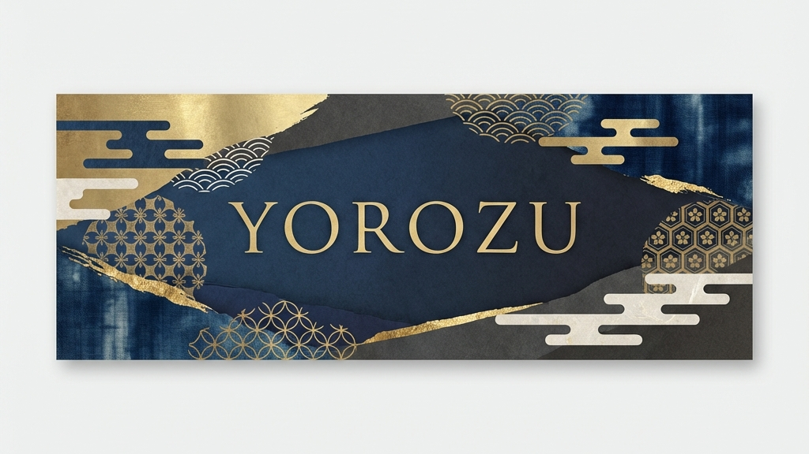
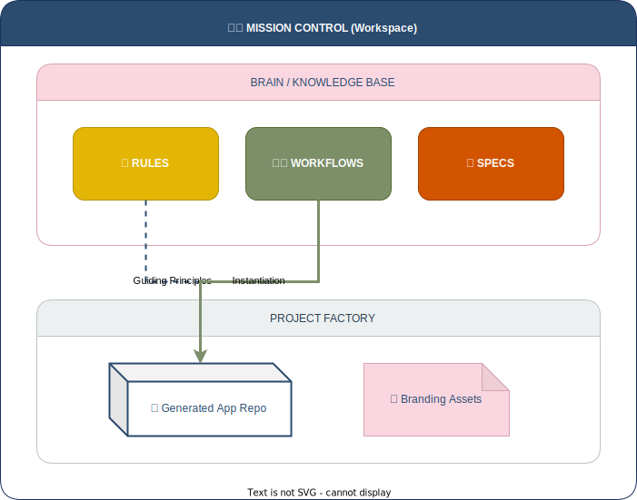

<div align="center">



# YOROZU
### ～ Your Own Repository Organization Zero-gravity Utility ～

<p align="center">
  
  
  
  
</p>

**Google Antigravity エージェントと協働するための、究極の「エージェント主導開発（ADE）」ワークスペース**

[コンセプトを読む](#concept) • [使い方](#getting-started) • [ワークフロー一覧](#workflow-catalog) • [技術仕様書](ANTIGRAVITY_AGENT_CONTROL_SPEC.MD)

</div>

---

## 🌌 Concept

**YOROZU（萬）** は、単なるリポジトリ管理ツールではありません。
これは、**「反復作業の重力」から開発者を解放するための、Google Antigravity専用の管制塔（Mission Control）** です。

従来の開発環境が「コードを書く場所」であったのに対し、YOROZUは「エージェントにタスクを委任し、指揮する場所」として設計されています。
`GAS_PROJECT` 配下に生成される全てのリポジトリは、ここで定義された **Rules（憲法）** と **Workflows（標準作業手順）** によって、統一された高品質な基準で管理されます。

### Core Philosophy
- **Automate Everything**: 初期化、コミット、リリース、品質チェックまで、あらゆるプロセスをWorkflowとして定義。
- **Agent First**: 人間が読みやすいだけでなく、AIエージェントが理解・実行しやすい構造を徹底。
- **Miyabi (雅)**: 機能性だけでなく、美しさと品格（Branding）を自動的に注入。

---

## 🚀 Getting Started

このワークスペースでは、**スラッシュコマンド（/）** を使用してエージェントに指示を出します。
複雑なプロンプトを考える必要はありません。定義済みのWorkflowを呼び出すだけで、熟練のエンジニアのような作業をエージェントが実行します。

### 基本的なコマンド

| コマンド | 説明 |
| :--- | :--- |
| **`/create-yorozu-project-complete`** | 🆕 **最強のスターター**<br>リポジトリ作成からブランド化、初期コミット、リリースまでを一撃で完了します。 |
| **`/build-app-simple`** | 🏗️ **アプリ実装**<br>要件を伝えるだけで、モダンで美しいWebアプリケーションを実装します。 |
| **`/create-release`** | 📦 **リリース自動化**<br>変更差分を解析し、美しいリリースノートとヘッダー画像を生成してGitHubへ公開します。 |

---

## 📂 Architecture

YOROZUは、複数のプロジェクトを統括する「メタ・ワークスペース」として機能します。



```text
d:/Prj/GAG_Workspace/            <-- 🛰️ Mission Control (Current)
├── .agent/                      <-- 🧠 Agent Brain
│   ├── rules/                   <-- 憲法 (Coding Standards, Branding Rules)
│   └── workflows/               <-- 手順書 (Deployment, Refactoring SOPs)
│
├── GAS_PROJECT/                 <-- 🏭 Project Factory
│   ├── my-cool-project/         <-- 📦 Generated Repo 1
│   ├── another-service/         <-- 📦 Generated Repo 2
│   └── prompt-repo/             <-- 📦 Prompt Management
│
└── ANTIGRAVITY_AGENT_...Spec.md <-- 📜 Technical Whitepaper
```

- **Mission Control**: あなたはここで指令を出します。
- **Project Factory**: エージェントは `GAS_PROJECT` ディレクトリ内に成果物を生成します。
- **Agent Brain**: エージェントの行動指針は全て `.agent` 内に集約されており、ここを修正するだけで全プロジェクトの挙動を調整できます。

---

## 📚 Workflow Catalog

利用可能な全ワークフロー（標準作業手順書）の一覧です。

### 🏗️ Project Creation (作成)
- **[🚀 Create YOROZU Project Complete](.agent/workflows/create-yorozu-project-complete.md)**: プロジェクト立ち上げの決定版。
- **[📂 Create Repo from Folder](.agent/workflows/create-repo-from-folder.md)**: 既存フォルダのリポジトリ化。
- **[🧠 Create Prompt Repo](.agent/workflows/create-prompt-repo.md)**: プロンプト管理専用リポジトリの作成。

### 💻 Development (開発)
- **[🏗️ Build App Simple](.agent/workflows/build-app-simple.md)**: 高速なプロトタイプ・アプリ開発。
- **[💾 Git Auto Commit](.agent/workflows/git-auto-commit.md)**: 粒度の細かいコミットとブランチ管理の自動化。

### 🎨 Branding & Assets (意匠)
- **[🌸 Update YOROZU Identity](.agent/workflows/update-yorozu-identity.md)**: 既存リポジトリを「YOROZU」ブランドへ改装。
- **[🎨 Generate Header Image](.agent/workflows/generate-header-image.md)**: 記事やREADME用のヘッダー画像生成。

### ✅ Quality & Release (品質・公開)
- **[🚀 Create Release](.agent/workflows/create-release.md)**: バージョニングとリリースノート生成。
- **[✅ Review Repo Quality](.agent/workflows/review-repo-quality.md)**: リポジトリの健康診断と改善提案。

---

## ⚖️ Rules & Policies

エージェントは以下のルール（[`.agent/rules`](.agent/rules/)）に従って自律的に判断を行います。

- **Repo Creation Rule**: 新規リポジトリ作成時は、自動的にYOROZU標準の `.gitignore` とディレクトリ構成を適用。
- **Branding Rule**: 日本の「雅」を感じさせるデザインと言葉遣いを優先（ユーザー指定がない場合）。
- **Safety First**: 破壊的なコマンド実行前には必ず確認を求め、安全性を担保。

---

<div align="center">

*Empowered by Google Antigravity & Gemini*
<br>
*Crafted with ❤️ in the Zero-gravity Zone*

</div>
